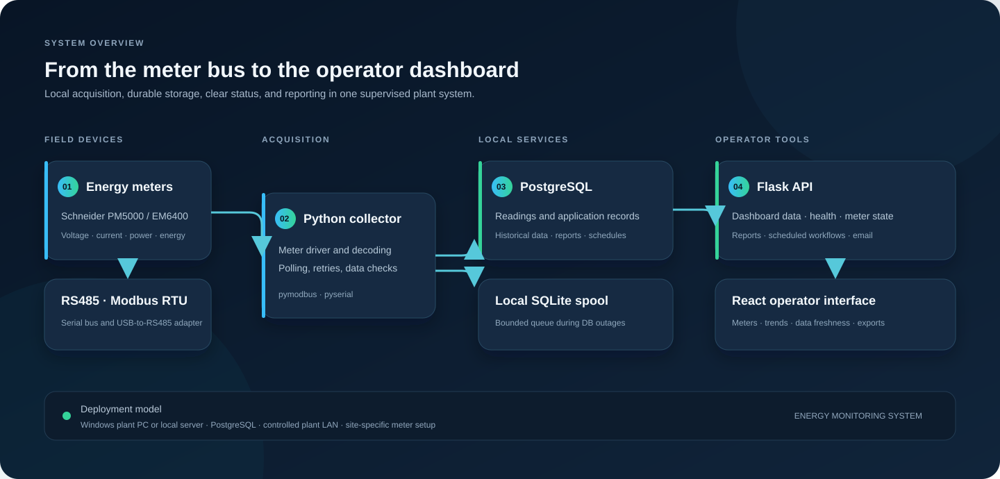

<div align="center">

# ⚡ Energy Monitoring System

### Industrial energy visibility, from the meter to the dashboard.

Monitor electrical data across production lines with a local-first IIoT platform for Modbus RTU meters, live dashboards, operational insights, and clear reporting.

[](https://github.com/VenuRathi/energy-monitoring-system/actions/workflows/ci.yml)
[](LICENSE)
[](https://www.python.org/)
[](frontend/)
[](docs/handover/production-deployment-checklist.md)

**Production use:** Verified and running 24/7 across **three production lines**. The production readiness checklist is approved.

</div>

---

## Energy data operators can use

Electrical data is most useful when operators can see what is happening across the site, follow changes over time, and share clear reports. This system brings meter readings and operational context into one local application for production, maintenance, and energy teams.

### What the system provides

- **Line-wide visibility** — view configured meters and their latest electrical readings from one dashboard.
- **Useful trends** — explore historical values and compare changes over selected time periods.
- **Operational awareness** — see meter communication state, reading freshness, and alerts in the same place.
- **Shareable reporting** — generate Excel and Word reports, with scheduled reporting workflows.
- **Local-first operation** — collect and store data on the site network using a Windows host and PostgreSQL.
- **Support for day-to-day operations** — use built-in health checks, backup tooling, and operator documentation.

## How it works



**Meters → Modbus RTU / RS485 → Python collector → PostgreSQL → Flask API → React dashboard and reports**

The application brings together live acquisition, historical data, system status, and reporting while keeping the site’s energy data within its local environment.

## Capabilities

| Area | What teams can do |
| --- | --- |
| Monitoring | View electrical readings and trends from configured meters. |
| Line awareness | Review meter status, recent data, and alerts in a unified interface. |
| Reporting | Create Excel and Word exports and use scheduled report workflows. |
| Operations | Check application health and follow deployment, backup, and recovery guides. |

## Built with

| Layer | Technology |
| --- | --- |
| Meter communication | RS485, Modbus RTU, `pymodbus`, `pyserial` |
| Backend | Python 3.11+, Flask |
| Data storage | PostgreSQL, with a local SQLite reading spool |
| Frontend | React, TypeScript, Vite, TanStack Query, Recharts |
| Deployment | Windows plant PC or local server |

## Get started

For a local development environment, see the [developer setup guide](docs/developer/local-setup.md). It covers prerequisites, database configuration, frontend setup, and meter configuration. Live meter communication requires compatible hardware and site-specific settings.

```powershell
python -m venv .venv
.\.venv\Scripts\Activate.ps1
pip install -r requirements.txt
Copy-Item .env.example .env
```

For the full application and operational setup, start with the documentation links below.

## Repository guide

| Path | What’s inside |
| --- | --- |
| `app/collectors/` | Modbus communication and meter drivers |
| `app/services/` | Polling, reading spool, retention, and report workflows |
| `app/database/` | PostgreSQL models and data access |
| `app/api/` | Flask API routes and services |
| `frontend/` | React and TypeScript operator interface |
| `deployment/`, `scripts/` | Windows setup, health, backup, and release tooling |
| `docs/` | Architecture, developer, operator, and deployment guides |
| `tests/` | Backend behavior and regression coverage |

## Documentation

- **Developers:** [Local setup](docs/developer/local-setup.md) · [Codebase map](docs/developer/codebase-map.md) · [Developer guide](docs/developer/developer-guide.md)
- **Operators:** [24/7 operations SOP](docs/handover/operations-sop-24x7.md) · [Troubleshooting](docs/handover/troubleshooting.md) · [Incident response](docs/handover/incident-response-guide.md)
- **Deployment:** [Deployment checklist](docs/handover/production-deployment-checklist.md) · [Backup and restore](docs/handover/backup-restore-sop.md) · [Windows installer](docs/handover/windows-installer-workflow.md)
- **Reference:** [Meter configuration](docs/reference/meter-configuration.md) · [Environment variables](docs/reference/environment-variables.md) · [API contract](docs/reference/openapi.yaml)

See the [documentation index](docs/README.md) for the full guide collection.

## Contributing and license

See [CONTRIBUTING.md](CONTRIBUTING.md) for development and change guidance. This project is distributed under the [MIT License](LICENSE).
