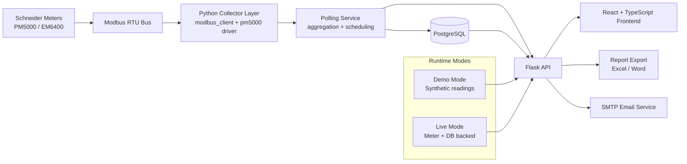

# Architecture Diagram

## Notes

- `DEMO_MODE=true` serves synthetic dashboard and alert data for demos.
- `DEMO_MODE=false` uses live meter/database paths.
- API remains the single integration boundary for frontend and exports.
